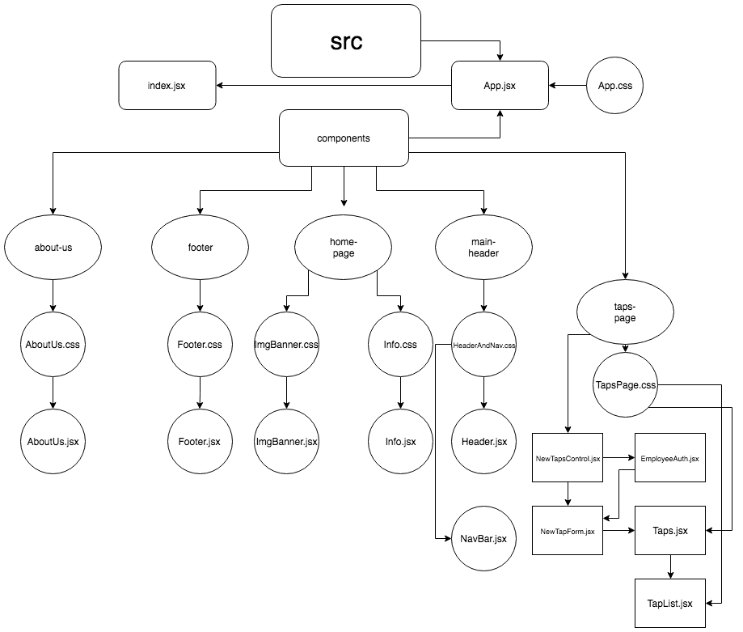

# ZomBit Tavern

## Description
ZomBit Tavern is a mix of Zombies and 8-bit art. This website displays what Zombit is all about and allows employees or zombies to keep inventory of newly tapped kegs. All art work is hand drawn by Crystal Fecteau.
#### By Crystal Fecteau

## Technologies Used
*React
*JSX
*CSS

## `Set-up/Install`

In the project directory, run:

### `npm install`

Installs npm packages in order to start the app

### `npm start`

Runs the app in the development mode. 
Open [http://localhost:3000](http://localhost:3000) to view it in the browser.

### How all components connect to the main index

## Known Bugs
*No know bugs at the moment

## Support and contact details

If you have any issues please contac:
* Crystal Fecteau - Crystal_Fecteau@ymail.com

This project was bootstrapped with [Create React App](https://github.com/facebook/create-react-app).  

### License

*This software is licensed under the MIT license*

Copyright (c) 2019**_{Crystal Fecteau}_
